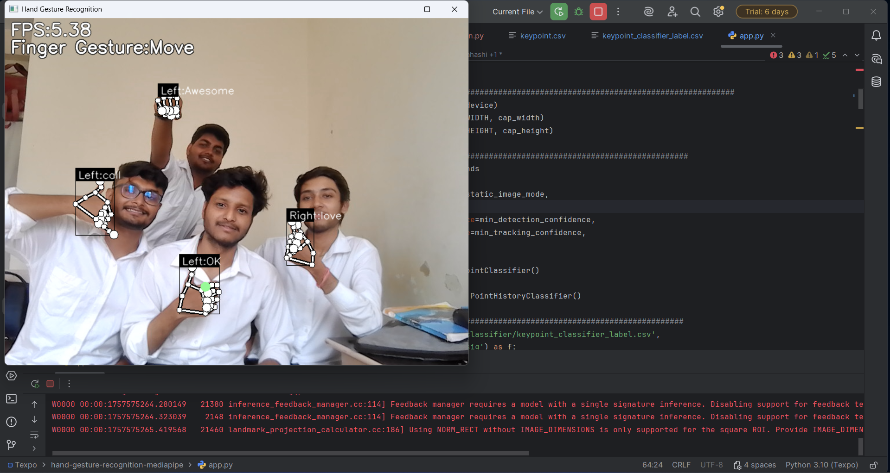

# Sign-Language-Translator

This project provides a real-time hand gesture recognition system using [MediaPipe](https://mediapipe.dev/) and deep learning classifiers. It includes a Python application for recognizing hand gestures from webcam input, as well as tools for training and evaluating keypoint and point history classifiers.



## Features

- Real-time hand gesture recognition using webcam
- Keypoint and point history classification
- Pre-trained models included
- Modular code structure for easy extension

## Project Structure

```
main.py
hand-gesture-recognition-mediapipe/
    app.py
    keypoint_classification_EN.ipynb
    keypoint_classification.ipynb
    point_history_classification.ipynb
    model/
        keypoint_classifier/
        point_history_classifier/
    utils/
```

- `main.py`: Entry point for the project.
- `hand-gesture-recognition-mediapipe/app.py`: Main application for gesture recognition.
- `model/`: Contains pre-trained models and related scripts.
- `utils/`: Utility functions (e.g., FPS calculation).
- Jupyter Notebooks: For training and experimenting with classifiers.

## Requirements

- Python 3.10+
- [MediaPipe](https://pypi.org/project/mediapipe/)
- OpenCV
- NumPy
- TensorFlow

Install dependencies with:

```powershell
pip install -r requirements.txt
```

> If `requirements.txt` is missing, install manually:
> ```powershell
> pip install mediapipe opencv-python numpy tensorflow
> ```

## Usage

To run the hand gesture recognition app:

```powershell
python hand-gesture-recognition-mediapipe/app.py
```

## Training

Use the provided Jupyter notebooks to train or fine-tune classifiers:

- `keypoint_classification_EN.ipynb`
- `keypoint_classification.ipynb`
- `point_history_classification.ipynb`

## Model Files

Pre-trained models are stored in:

- `model/keypoint_classifier/`
- `model/point_history_classifier/`

## License

See [hand-gesture-recognition-mediapipe/LICENSE](hand-gesture-recognition-mediapipe/LICENSE).

## Acknowledgements

- [MediaPipe](https://mediapipe.dev/)
- Original gesture recognition codebase inspiration

---

Feel free to contribute or open issues!